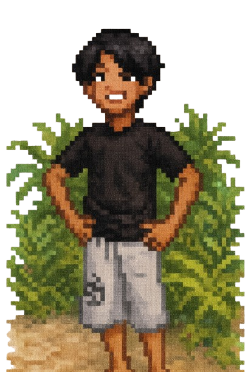

  
  <h1 align="center">hey there 👋</h1>  <h3 align="left">👩‍💻  About Me</h3>  
🎓 I’m an Informatics Engineering student at Universitas Yudharta, Pasuruan   💻 I love exploring backend development and building real-world applications   🧠 Passionate about Artificial Intelligence and automation  ---  🔭 I’m currently working on: - 🐔 A poultry ordering application as part of an RPA development project   - 🚗 A backend API for a ride-sharing application   - 🌐 Enhancing my skills in Go (Golang) and MongoDB for scalable backend development   🌱 I’m currently learning: - Golang backend architecture and RESTful API design - MongoDB integration with Go - AI concepts for future projects
  <h3 align="left">🛠 Language and tools</h3>  
                            
 

